<div align="center">

# Brolostack


### **A Local-First Full-Stack Framework with Optional Cloud Integration**

[](https://github.com/Beunec/brolostack)
[](LICENSE)
[](https://www.typescriptlang.org/)
[](https://github.com/Beunec/brolostack)
[](https://www.npmjs.com/package/brolostack)
[](https://github.com/Beunec/brolostack/stargazers)

Brolostack 1.0 | **Public Release Date**: September 20, 2025 | **NPM Version**: 1.0.2 

*Brolostack is a local-first full-stack framework that operates entirely in the user's browser with optional cloud integration. It provides enterprise-grade capabilities including AI frameworks, zero-knowledge security, multi-provider authentication, and real-time communication while maintaining zero server costs for core functionality.*

**🌐 Learn More**: [www.brolostack.com](https://www.brolostack.com)

[📖 Documentation](docs/) • [🚀 Quick Start](docs/GETTING_STARTED.md) • [💡 Examples](examples/) • [🤖 AI Framework](docs/BROLOSTACK_AI_FRAMEWORK.md) • [🔐 Security](docs/BROLOSTACK_DEVIL_SECURITY_FRAMEWORK.md) • [📡 WebSocket](docs/BROLOSTACK_WEBSOCKET_FRAMEWORK.md) • [☁️ Cloud](docs/BROLOSTACK_CLOUD_INTEGRATION_IMPLEMENTATION.md)

</div>

---

## 📋 Table of Contents

- [🎯 Overview](#-overview)
- [✨ Key Features](#-key-features)
- [🏗️ Architecture](#️-architecture)
- [🚀 Quick Start](#-quick-start)
- [📚 Documentation Guide](#-documentation-guide)
- [🤖 AI Integration](#-ai-integration)
- [🔐 Security Features](#-security-features)
- [📡 Real-Time Communication](#-real-time-communication)
- [☁️ Cloud Integration](#️-cloud-integration)
- [📊 Performance Metrics](#-performance-metrics)
- [🌐 Browser Compatibility](#-browser-compatibility)
- [📁 Project Structure](#-project-structure)
- [🧪 Examples](#-examples)
- [🤝 Contributing](#-contributing)
- [📄 License](#-license)

---

## 🎯 Overview

Brolostack (Browser Local Stack) is a local-first full-stack framework that operates entirely in the user's browser with optional cloud integration. By leveraging browser storage as a persistent database, Brolostack eliminates server costs for core functionality while providing enterprise-grade capabilities including AI frameworks, security, authentication, and real-time communication.

### 🎨 **Brolostack v1.0.2 Architecture**

```mermaid
graph TB
    subgraph "🌐 Browser Environment"
        A[User Interface] --> B[Brolostack Core v1.0.2]
        B --> C[Storage Layer]
        B --> D[AI Framework]
        B --> E[Security Layer]
        B --> F[WebSocket Manager]
        B --> G[Auth Manager]
        
        C --> H[IndexedDB]
        C --> I[localStorage]
        C --> J[sessionStorage]
        C --> K[Memory]
        
        D --> L[BrolostackAIFramework]
        D --> M[BrolostackBSDGF4AI]
        D --> N[Reasoning Frameworks]
        D --> O[Token Control]
        
        E --> P[BrolostackDevil]
        E --> Q[SecurityAuditor]
        E --> R[Source Protection]
        
        F --> S[WSMultiagent]
        F --> T[WSClientside]
        F --> U[ARGS Protocol]
        
        G --> V[CIAM Providers]
        G --> W[Session Management]
    end
    
    subgraph "☁️ Optional Cloud (22 Providers)"
        X[CloudBrolostack] --> Y[AWS/Azure/GCP]
        X --> Z[MongoDB/Redis]
        X --> AA[Enterprise Cloud]
    end
    
    B -.-> X
    
    style A fill:#e1f5fe
    style B fill:#f3e5f5
    style D fill:#fff3e0
    style E fill:#ffebee
    style F fill:#e8f5e8
    style G fill:#fce4ec
```

### 💡 Core Philosophy

| Traditional Approach | Brolostack Approach |
|---------------------|-------------------|
| 🏢 Centralized servers | 🌐 Browser-based storage |
| 💰 Monthly hosting costs | 🆓 Zero core costs |
| 🔧 Complex deployment | 📦 Static deployment |
| 🗄️ Database management | 💾 Browser storage |
| 🔒 Server security concerns | 🛡️ Client-side privacy |

---

## ✨ Key Features

### 🚀 **Local-First Architecture**
- **Zero server costs** - Core functionality requires no backend
- **Offline-first** - Works completely without internet connection
- **Browser storage** - Uses IndexedDB, localStorage, and memory
- **Static deployment** - Deploy to any static hosting service

### 🤖 **Comprehensive AI Framework**
- **18+ AI providers** - OpenAI, Anthropic, Google, Azure, AWS, and more
- **4 reasoning frameworks** - ReAct, Chain-of-Thought, Tree-of-Thoughts, Self-Consistency
- **AI governance** - 13 safety modules for responsible AI usage
- **Token control** - Cost management with 3 control levels

### 🔐 **Advanced Security (Brolostack Devil)**
- **Zero-knowledge encryption** - Quantum-resistant security
- **Source code protection** - Multi-language obfuscation
- **Self-evolving security** - Dynamic encryption patterns
- **Anti-debugging** - Browser developer tools protection

### 🔑 **Multi-Provider Authentication**
- **9 CIAM providers** - Auth0, Microsoft Entra ID, Amazon Cognito, etc.
- **Hybrid authentication** - Combine Brolostack with third-party providers
- **Session management** - Cross-provider synchronization
- **MFA support** - Multi-factor authentication integration

### 📡 **Real-Time Communication**
- **WebSocket framework** - BrolostackWSMultiagent and BrolostackWSClientside
- **ARGS protocol** - Agent Real-time Governance & Streaming
- **Backend integration** - Node.js and Python integration utilities
- **Environment-aware** - Automatic optimization per environment

### ☁️ **Optional Cloud Integration**
- **22 cloud providers** - AWS, Azure, GCP, MongoDB Atlas, Redis Cloud, etc.
- **Local-first design** - Cloud sync is completely optional
- **Multi-cloud support** - Use multiple providers simultaneously
- **Conflict resolution** - Multiple strategies for data conflicts

---

## 🏢 Author & Organization

- **Author**: Olu Akinnawo
- **Department**: Technology & Innovation 
- **Owner**: Beunec Technologies, Inc.
- **License**: MIT
- **Github Repository**: https://github.com/Beunec/brolostack

---

## 🏗️ Architecture

### 📊 **Brolostack v1.0.2 System Architecture**

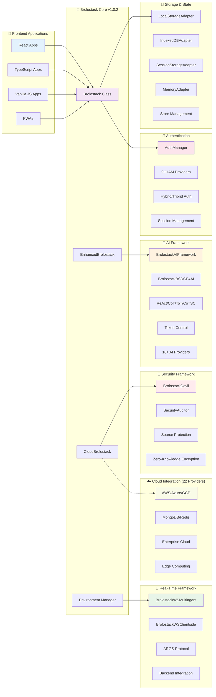

### 🔄 **v1.0.2 Data Flow with Enterprise Features**

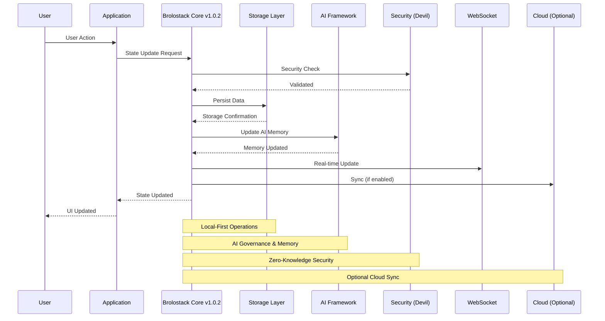

---

## 🚀 Quick Start

### 📦 Installation

**📦 [View on npm](https://www.npmjs.com/package/brolostack)**

```bash
# Install Brolostack
npm install brolostack

# Or with yarn
yarn add brolostack

# Or with pnpm
pnpm add brolostack
```

### 🎯 Basic Usage

```typescript
import { Brolostack } from 'brolostack';

// Initialize the framework
const app = new Brolostack({
  appName: 'my-awesome-app',
  version: '1.0.2'
});

// Create a data store
const userStore = app.createStore('users', {
  users: [],
  currentUser: null,
  
  // Actions
  addUser: (user) => set(state => ({ 
    users: [...state.users, user] 
  })),
  
  removeUser: (id) => set(state => ({ 
    users: state.users.filter(u => u.id !== id) 
  })),
  
  setCurrentUser: (user) => set(state => ({ 
    currentUser: user 
  }))
});

// Initialize the app
await app.initialize();

// Use the store
const users = userStore.getState().users;
const addUser = userStore.getState().addUser;
```

### ⚛️ **React Integration v1.0.2**

```typescript
import { BrolostackProvider, useBrolostack } from 'brolostack/react';

function App() {
  return (
    <BrolostackProvider 
      appName="my-awesome-app"
      config={{
        version: '1.0.2',
        storage: {
          engine: 'indexedDB',
          name: 'my-app-storage',
          version: 1
        }
      }}
    >
      <MyApplication />
    </BrolostackProvider>
  );
}

// Use Brolostack in components
function UserList() {
  const { stores } = useBrolostack();
  const userStore = stores.get('users');
  const users = userStore?.getState().users || [];
  
  return (
    <div>
      {users.map(user => (
        <div key={user.id}>
          {user.name} - {user.email}
        </div>
      ))}
    </div>
  );
}
```

### 🤖 **AI Framework v1.0.2**

```typescript
import { BrolostackAIFramework } from 'brolostack';

// Initialize AI framework with governance
const aiFramework = new BrolostackAIFramework({
  provider: {
    name: 'openai',
    apiKey: 'your-api-key',
    model: 'gpt-4'
  },
  reasoning: { 
    framework: 'cot' // Chain-of-Thought reasoning
  },
  governance: {
    enabled: true,
    config: {
      hallucination: { enabled: true, threshold: 0.8 },
      toxicLanguage: { enabled: true, strictMode: true },
      bias: { enabled: true, categories: ['gender', 'race'] }
    }
  },
  tokenUsage: {
    controlLevel: 'strict',
    limits: {
      maxInputTokens: 4000,
      maxOutputTokens: 2000
    }
  }
});

// Process query with AI governance
const result = await aiFramework.processQuery('Analyze this data', {
  data: userStore.getState().users,
  context: 'user management analysis'
});

console.log('AI Response:', result.response);
console.log('Safety Score:', result.governance.safetyScore);
```

---

## 📚 Documentation Guide

### 🎯 **Quick Navigation**

| Documentation | Description | Level | Link |
|--------------|-------------|-------|------|
| **Getting Started** | 5-minute setup guide | Beginner | [📖 Read](docs/GETTING_STARTED.md) |
| **AI Framework** | Complete AI integration guide | Intermediate | [🤖 Read](docs/BROLOSTACK_AI_FRAMEWORK.md) |
| **Security Framework** | Zero-knowledge security guide | Advanced | [🔐 Read](docs/BROLOSTACK_DEVIL_SECURITY_FRAMEWORK.md) |
| **WebSocket Framework** | Real-time communication guide | Intermediate | [📡 Read](docs/BROLOSTACK_WEBSOCKET_FRAMEWORK.md) |
| **Cloud Integration** | Optional cloud services guide | Advanced | [☁️ Read](docs/BROLOSTACK_CLOUD_INTEGRATION_IMPLEMENTATION.md) |
| **Authentication** | CIAM and multi-provider auth | Advanced | [🔑 Read](docs/BROLOSTACK_CIAM_INTEGRATION_COMPLETE.md) |
| **Backend Integration** | Node.js and Python integration | Advanced | [🔧 Read](docs/BROLOSTACK_BACKEND_INTEGRATION.md) |
| **Enterprise Features** | Complete enterprise capabilities | Expert | [🏢 Read](docs/BROLOSTACK_ENTERPRISE_FEATURES_v1.0.2.md) |
| **Framework Status** | Current implementation status | Reference | [📊 Read](docs/BROLOSTACK_FRAMEWORK_STATUS.md) |

### 🎓 **Learning Path**

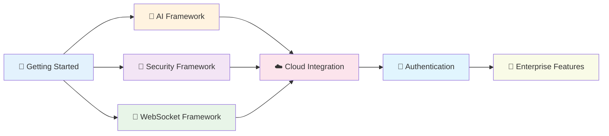

### 📋 **Documentation by Use Case**

| Use Case | Recommended Reading | Time Investment |
|----------|-------------------|-----------------|
| **Personal Projects** | Getting Started → Examples | 30 minutes |
| **AI Applications** | Getting Started → AI Framework → Security | 2 hours |
| **Enterprise Apps** | All Core Docs → Enterprise Features | 4 hours |
| **Real-Time Apps** | Getting Started → WebSocket → Backend Integration | 3 hours |
| **Secure Applications** | Security Framework → Authentication → Enterprise | 3 hours |

---

## 🤖 AI Integration

Brolostack includes a comprehensive AI framework with multiple reasoning patterns and safety governance.

### 🧠 **AI Reasoning Frameworks**

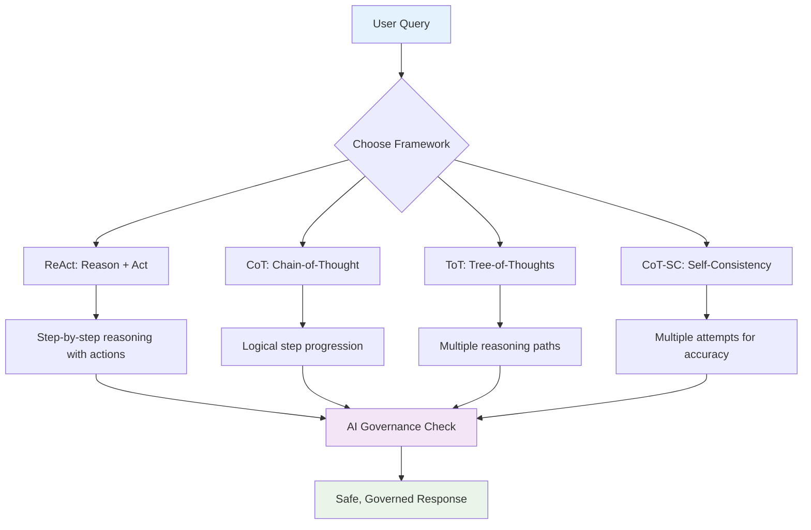

### 🛡️ **AI Governance (BrolostackBSDGF4AI)**

| Safety Module | Description | Purpose |
|--------------|-------------|---------|
| **Hallucination Detection** | Identifies false AI claims | Accuracy |
| **Jailbreak Prevention** | Blocks prompt injection attacks | Security |
| **Toxic Language Filter** | Removes harmful content | Safety |
| **Bias Detection** | Identifies unfair responses | Fairness |
| **Privacy Protection** | Detects PII exposure | Privacy |
| **Context Drift** | Monitors conversation coherence | Quality |
| **Industry Readiness** | Domain-specific validation | Compliance |

### 💰 **Token Usage Control**

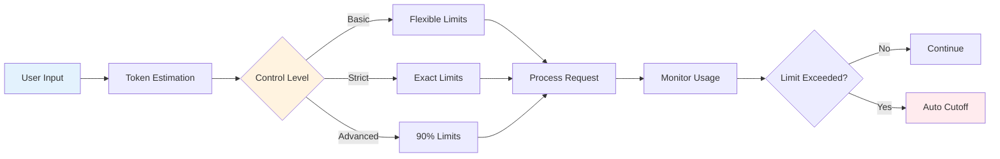

---

## 🔐 Security Features

Brolostack Devil provides comprehensive security with zero-knowledge encryption and source code protection.

### 🛡️ **Security Architecture**

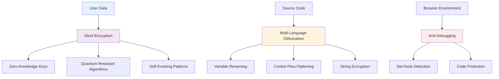

### 🔒 **Security Capabilities**

| Feature | Description | Protection Level |
|---------|-------------|------------------|
| **Zero-Knowledge Encryption** | Keys never leave client | Maximum |
| **Quantum-Resistant** | Future-proof algorithms | Maximum |
| **Source Code Obfuscation** | Multi-language protection | High |
| **Anti-Debugging** | DevTools protection | High |
| **Self-Evolving Security** | Dynamic patterns | Maximum |

---

## 📡 Real-Time Communication

Brolostack includes advanced WebSocket capabilities with the ARGS protocol for multi-agent coordination.

### 🌐 **WebSocket Architecture**

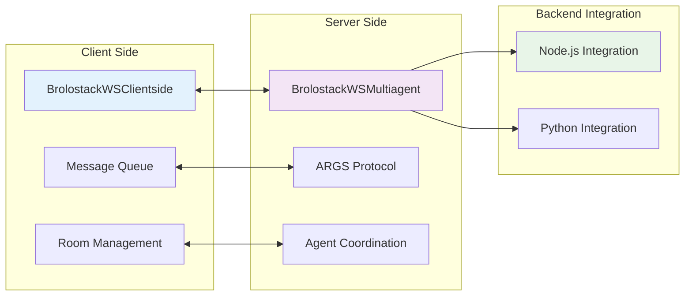

### 📡 **ARGS Protocol Features**

| Message Type | Purpose | Use Case |
|-------------|---------|----------|
| **AGENT_REGISTER** | Register new agents | Multi-agent setup |
| **TASK_START** | Begin collaborative task | Task coordination |
| **COLLABORATION_REQUEST** | Agent-to-agent communication | Agent collaboration |
| **STREAM_DATA** | Real-time data streaming | Live updates |
| **HEARTBEAT** | Connection monitoring | System health |

---

## 📊 Performance Metrics

### 📊 **Framework Performance**

| Metric | Value | Description |
|--------|-------|-------------|
| **Bundle Size** | 319KB | Main framework bundle |
| **React Bundle** | 328KB | React integration bundle |
| **Dependencies** | 4 packages | Minimal, secure dependencies |
| **TypeScript Support** | 100% | Complete type coverage |
| **Build Time** | ~60 seconds | Full framework build |

### 🎯 **Storage Performance**

| Storage Type | Capacity | Speed | Persistence |
|-------------|----------|-------|-------------|
| **IndexedDB** | ~1GB+ | Fast | Permanent |
| **localStorage** | ~10MB | Very Fast | Permanent |
| **sessionStorage** | ~10MB | Very Fast | Session Only |
| **Memory** | RAM Limited | Instant | Temporary |

### ⚡ **Real-World Metrics**

| Application Type | Bundle Impact | Typical Storage | Load Performance |
|-----------------|---------------|-----------------|------------------|
| **Basic App** | +319KB | 1-5MB | < 100ms |
| **AI App** | +328KB | 10-50MB | < 200ms |
| **Enterprise App** | +350KB | 50-200MB | < 300ms |
| **Multi-Cloud App** | +400KB | 100-500MB | < 500ms |

---

## 🌐 Browser Compatibility

### 📊 Browser Support Matrix

| Browser | Version | IndexedDB | localStorage | sessionStorage | Private Mode | Status |
|---------|---------|-----------|--------------|----------------|--------------|--------|
| **Chrome** | 60+ | ✅ | ✅ | ✅ | ✅ | 🟢 Full Support |
| **Firefox** | 55+ | ✅ | ✅ | ✅ | ✅ | 🟢 Full Support |
| **Safari** | 12+ | ✅ | ✅ | ✅ | ✅ | 🟢 Full Support |
| **Edge** | 79+ | ✅ | ✅ | ✅ | ✅ | 🟢 Full Support |
| **Brave** | 1.0+ | ✅ | ✅ | ✅ | ✅ | 🟢 Full Support |
| **DuckDuckGo** | 7.0+ | ✅ | ✅ | ✅ | ✅ | 🟢 Full Support |
| **Opera** | 47+ | ✅ | ✅ | ✅ | ✅ | 🟢 Full Support |

### 🔒 Private Mode Support

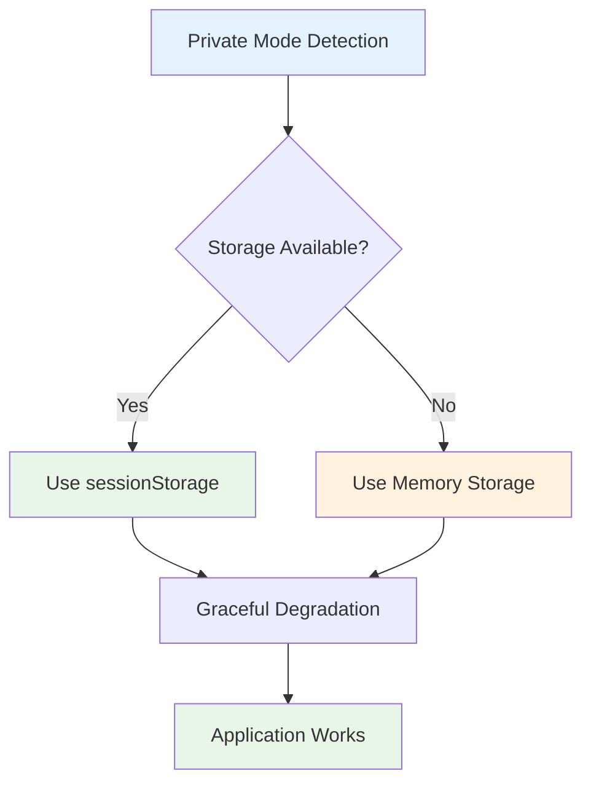

### 📱 Mobile Support

| Platform | iOS | Android | Windows Mobile | Status |
|----------|-----|---------|----------------|--------|
| **Safari Mobile** | 12+ | - | - | 🟢 Full Support |
| **Chrome Mobile** | - | 60+ | - | 🟢 Full Support |
| **Firefox Mobile** | - | 55+ | - | 🟢 Full Support |
| **Edge Mobile** | - | - | 79+ | 🟢 Full Support |

---

## ☁️ Cloud Integration

### 🔗 Optional Cloud Services

Brolostack provides optional cloud integration while maintaining its local-first architecture. Cloud adapters enable data synchronization, backup, and multi-device access.

### 🌐 **Supported Cloud Providers**

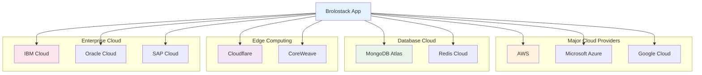

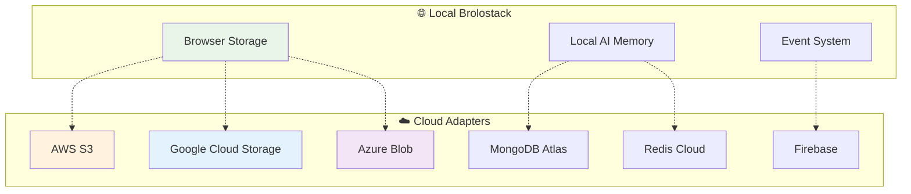

### 🛠️ **Cloud Integration v1.0.2**

```typescript
import { CloudBrolostack } from 'brolostack';

// Initialize with multi-cloud integration
const cloudApp = new CloudBrolostack({
  appName: 'my-cloud-app',
  version: '1.0.2',
  cloud: {
    enabled: true,
    adapters: [
      {
        name: 'aws',
        provider: 'aws',
        config: {
          region: 'us-east-1',
          accessKeyId: 'your-key',
          secretAccessKey: 'your-secret'
        },
        enabled: true,
        priority: 1
      },
      {
        name: 'mongodb',
        provider: 'mongodb',
        config: {
          connectionString: 'mongodb://your-cluster'
        },
        enabled: true,
        priority: 2
      }
    ],
    syncStrategy: 'local-first',
    conflictResolution: 'client-wins',
    autoSync: true,
    syncInterval: 60000 // 1 minute
  }
});

// Initialize cloud integration
await cloudApp.initializeCloudIntegration();

// Manual operations available
await cloudApp.syncToCloud();
await cloudApp.backupToCloud();
```

### 📊 **Deployment Options v1.0.2**

| Feature | Local Only | Cloud Integrated | Multi-Cloud |
|---------|------------|------------------|-------------|
| **Server Costs** | $0 | $0 (client-side) | $0 (client-side) |
| **Cloud Storage** | None | Provider-specific | Multiple providers |
| **Data Access** | Instant | Local + Sync | Local + Multi-Sync |
| **Offline Support** | Full | Full | Full |
| **Multi-Device** | No | Yes | Yes |
| **Collaboration** | Single User | Multi-User | Multi-User |
| **Backup** | Manual Export | Automatic | Multi-Provider |

---

## 🤖 AI Integration

### 🧠 AI Memory System

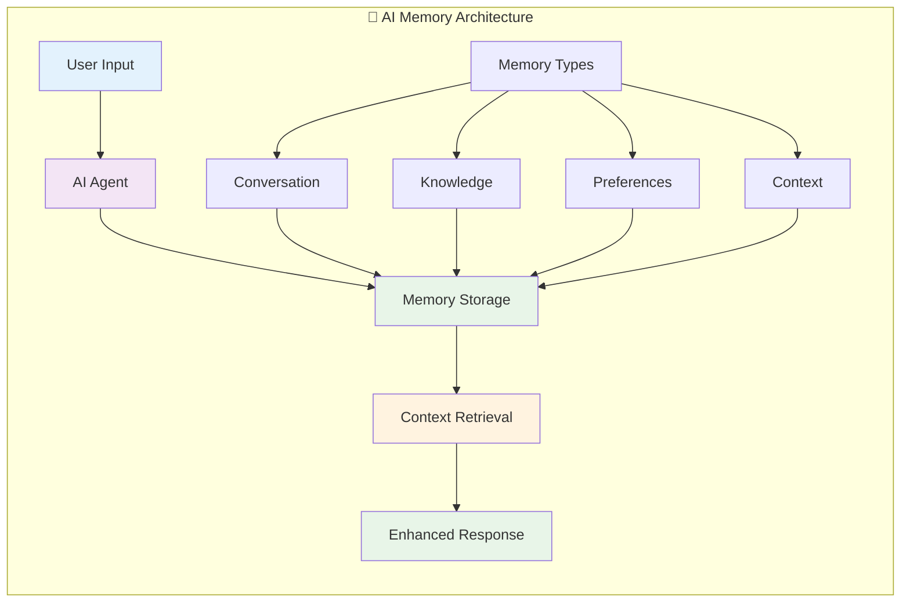

### 🎯 **AI Framework v1.0.2 Features**

| Component | Description | Implementation Status |
|-----------|-------------|---------------------|
| **BrolostackAIFramework** | Main AI coordination system | ✅ Complete |
| **BrolostackBSDGF4AI** | 13 safety governance modules | ✅ Complete |
| **4 Reasoning Frameworks** | ReAct, CoT, ToT, CoT-SC | ✅ Complete |
| **Token Usage Control** | 3-level cost management | ✅ Complete |
| **18+ AI Providers** | Unified provider interface | ✅ Complete |
| **React Integration** | AI hooks and components | ✅ Complete |

### 💡 **AI Framework Usage v1.0.2**

```typescript
import { BrolostackAIFramework, BrolostackBSDGF4AI } from 'brolostack';

// Initialize AI framework with complete governance
const aiFramework = new BrolostackAIFramework({
  provider: {
    name: 'openai',
    apiKey: 'your-api-key',
    model: 'gpt-4'
  },
  reasoning: { framework: 'cot' },
  governance: {
    enabled: true,
    config: {
      hallucination: { enabled: true, threshold: 0.8 },
      toxicLanguage: { enabled: true },
      bias: { enabled: true },
      privacy: { enabled: true }
    }
  },
  tokenUsage: {
    controlLevel: 'strict',
    limits: { maxInputTokens: 4000, maxOutputTokens: 2000 }
  }
});

// Process query with reasoning and governance
const result = await aiFramework.processQuery(
  'Analyze user behavior patterns',
  { data: userStore.getState().users }
);

// Access reasoning steps and safety scores
console.log('Reasoning:', result.reasoning);
console.log('Safety Score:', result.governance.safetyScore);
console.log('Token Usage:', result.tokenUsage);
```

---

## 📁 Project Structure

```
📦 brolostack/ (v1.0.2)
├── 📄 LICENSE                    # MIT License
├── 📄 README.md                  # This file
├── 📄 SECURITY.md                # Security policy
├── 📄 package.json               # Package configuration (v1.0.2)
├── 📄 tsconfig.json              # TypeScript configuration
├── 📄 rollup.config.js           # Build configuration
│
├── 📁 src/                       # Source code
│   ├── 📁 core/                  # Core framework
│   │   ├── 📄 Brolostack.ts      # Main framework class
│   │   ├── 📄 EnhancedBrolostack.ts # Enhanced features
│   │   ├── 📄 CloudBrolostack.ts # Cloud integration
│   │   └── 📄 EnvironmentManager.ts # Environment management
│   │
│   ├── 📁 ai/                    # AI framework (Complete)
│   │   ├── 📄 BrolostackAIFramework.ts # Main AI framework
│   │   ├── 📁 governance/        # AI governance
│   │   │   └── 📄 BrolostackBSDGF4AI.ts # 13 safety modules
│   │   ├── 📁 argprotocol/       # 4 reasoning frameworks
│   │   │   ├── 📄 BrolostackReAcT.ts
│   │   │   ├── 📄 BrolostackCoT.ts
│   │   │   ├── 📄 BrolostackToT.ts
│   │   │   └── 📄 BrolostackCoTSC.ts
│   │   └── 📁 providers/         # 18+ AI providers
│   │
│   ├── 📁 security/              # Security framework (Devil)
│   │   ├── 📄 BrolostackDevil.ts # Zero-knowledge security
│   │   ├── 📄 BrolostackDevilSourceCode.ts # Source protection
│   │   └── 📄 SecurityAuditor.ts # Security auditing
│   │
│   ├── 📁 auth/                  # Authentication (CIAM)
│   │   └── 📄 AuthManager.ts     # 9 CIAM providers + hybrid auth
│   │
│   ├── 📁 realtime/              # Real-time communication
│   │   ├── 📄 BrolostackWSMultiagent.ts # Server-side WebSocket
│   │   ├── 📄 BrolostackWSClientside.ts # Client-side WebSocket
│   │   ├── 📄 WebSocketManager.ts # WebSocket management
│   │   └── 📁 protocols/
│   │       └── 📄 ARGSProtocol.ts # Agent protocol
│   │
│   ├── 📁 cloud/                 # Cloud integration (22 providers)
│   │   ├── 📄 CloudBrolostack.ts
│   │   └── 📁 providers/         # AWS, Azure, GCP, MongoDB, etc.
│   │
│   ├── 📁 react/                 # React integration (Complete)
│   │   ├── 📄 BrolostackProvider.tsx # Main provider
│   │   ├── 📄 BrolostackAIProvider.tsx # AI provider
│   │   ├── 📄 BrolostackCIAMProvider.tsx # Auth provider
│   │   ├── 📄 BrolostackDevilProvider.tsx # Security provider
│   │   └── 📄 useTokenUsage.tsx  # Token control hook
│   │
│   └── 📄 index.ts               # Main entry point (357 exports)
│
├── 📁 docs/                      # Comprehensive documentation
│   ├── 📄 GETTING_STARTED.md     # 5-minute setup guide
│   ├── 📄 BROLOSTACK_AI_FRAMEWORK.md # AI framework guide
│   ├── 📄 BROLOSTACK_DEVIL_SECURITY_FRAMEWORK.md # Security guide
│   ├── 📄 BROLOSTACK_WEBSOCKET_FRAMEWORK.md # WebSocket guide
│   ├── 📄 BROLOSTACK_CIAM_INTEGRATION_COMPLETE.md # Auth guide
│   ├── 📄 BROLOSTACK_CLOUD_INTEGRATION_IMPLEMENTATION.md # Cloud guide
│   ├── 📄 BROLOSTACK_BACKEND_INTEGRATION.md # Backend integration
│   └── 📄 BROLOSTACK_FRAMEWORK_STATUS.md # Framework status
│
├── 📁 examples/                  # Working examples (7 complete examples)
│   ├── 📁 ai-framework-showcase/ # AI framework demo
│   ├── 📁 devil-security-showcase/ # Security demo
│   ├── 📁 websocket-showcase/    # WebSocket demo
│   ├── 📁 ciam-showcase/         # Authentication demo
│   ├── 📁 token-usage-showcase/  # Token control demo
│   ├── 📁 environment-showcase/  # Environment demo
│   └── 📁 enterprise-multi-provider/ # Complete enterprise setup
│
├── 📁 dist/                      # Built packages
│   ├── 📄 index.js               # UMD build (319KB)
│   ├── 📄 index.esm.js           # ES module build (319KB)
│   ├── 📄 index.d.ts             # TypeScript definitions (310KB)
│   ├── 📄 react.js               # React UMD build (328KB)
│   ├── 📄 react.esm.js           # React ES module build (328KB)
│   └── 📄 react.d.ts             # React TypeScript definitions (6KB)
│
└── 📁 scripts/                   # Utility scripts
    ├── 📄 production-check.js     # Production readiness validation
    ├── 📄 validate-docs.js        # Documentation quality check
    └── 📄 update-docs.js          # Documentation maintenance
```

---

## 🧪 Examples

### 🎯 **Available Examples**

| Example | Features Demonstrated | Complexity | Documentation |
|---------|---------------------|------------|---------------|
| **AI Framework Showcase** | AI reasoning, governance, token control | ⭐⭐⭐ | [📖 Guide](examples/ai-framework-showcase/README.md) |
| **Devil Security Showcase** | Zero-knowledge encryption, source protection | ⭐⭐⭐⭐ | [🔐 Guide](examples/devil-security-showcase/README.md) |
| **WebSocket Showcase** | Real-time communication, ARGS protocol | ⭐⭐⭐ | [📡 Guide](examples/websocket-showcase/README.md) |
| **CIAM Showcase** | Multi-provider authentication | ⭐⭐⭐ | [🔑 Guide](examples/ciam-showcase/README.md) |
| **Token Usage Showcase** | AI cost control and monitoring | ⭐⭐ | [💰 Guide](examples/token-usage-showcase/README.md) |
| **Environment Showcase** | Environment-aware configuration | ⭐⭐ | [🌍 Guide](examples/environment-showcase/README.md) |
| **Enterprise Multi-Provider** | Complete enterprise setup | ⭐⭐⭐⭐ | [🏢 Guide](examples/enterprise-multi-provider/README.md) |

### 🚀 **Quick Example Categories**

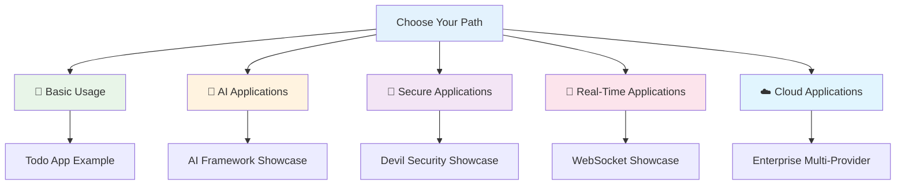

### 🚀 Quick Example: Todo App

```typescript
import { Brolostack } from 'brolostack';

// Initialize app
const app = new Brolostack({
  appName: 'todo-app',
  version: '1.0.2'
});

// Create todo store
const todoStore = app.createStore('todos', {
  todos: [],
  filter: 'all',
  
  addTodo: (text) => set(state => ({
    todos: [...state.todos, {
      id: Date.now(),
      text,
      completed: false,
      createdAt: new Date()
    }]
  })),
  
  toggleTodo: (id) => set(state => ({
    todos: state.todos.map(todo =>
      todo.id === id ? { ...todo, completed: !todo.completed } : todo
    )
  })),
  
  setFilter: (filter) => set(state => ({ filter }))
});

// Use in components
function TodoApp() {
  const todos = todoStore.useStore(state => state.todos);
  const filter = todoStore.useStore(state => state.filter);
  const addTodo = todoStore.useStore(state => state.addTodo);
  
  return (
    <div>
      <input 
        onKeyPress={(e) => {
          if (e.key === 'Enter') {
            addTodo(e.target.value);
            e.target.value = '';
          }
        }}
        placeholder="Add a todo..."
      />
      {todos.map(todo => (
        <div key={todo.id}>
          <input 
            type="checkbox" 
            checked={todo.completed}
            onChange={() => toggleTodo(todo.id)}
          />
          {todo.text}
        </div>
      ))}
    </div>
  );
}
```

---

## 📈 Roadmap

### 🗓️ **Development Timeline v1.0.2**

```mermaid
gantt
    title Brolostack v1.0.2 Development Status
    dateFormat  YYYY-MM-DD
    section Core Framework v1.0.2
    Core Framework        :done, core1, 2025-07-01, 2025-09-20
    AI Framework         :done, ai1, 2025-08-01, 2025-09-20
    Security Framework   :done, sec1, 2025-08-15, 2025-09-20
    WebSocket Framework  :done, ws1, 2025-09-01, 2025-09-20
    
    section Enterprise Features
    Authentication (CIAM) :done, auth1, 2025-09-05, 2025-09-20
    Cloud Integration    :done, cloud1, 2025-09-10, 2025-09-20
    Environment Management :done, env1, 2025-09-15, 2025-09-20
    Production Ready     :done, prod1, 2025-09-20, 2025-09-20
    
    section Future Development
    Performance Optimization :active, perf1, 2025-10-01, 2025-12-31
    Additional Providers :future, prov1, 2026-01-01, 2026-03-31
    Mobile Integration   :future, mobile1, 2026-04-01, 2026-06-30
```

### 🎯 **Planned Improvements**

| Version | Timeframe | Focus Areas |
|---------|-----------|-------------|
| **v1.0.3** | Q4 2025 | Performance optimizations, bug fixes |
| **v1.1.0** | Q1 2026 | Enhanced AI capabilities, additional providers |
| **v1.2.0** | Q2 2026 | Advanced cloud features, improved sync |
| **v2.0.0** | Q3 2026 | Architecture improvements, plugin system |

### 🔮 **Future Considerations**

- **Performance**: Bundle size optimization, faster initialization
- **AI**: Additional reasoning frameworks, improved governance
- **Cloud**: More provider adapters, enhanced sync strategies
- **Mobile**: React Native integration, mobile optimizations
- **Developer Experience**: Enhanced tooling, better debugging

---

## 🤝 Contributing

We welcome contributions from the community! Here's how you can help:

### 🛠️ Development Setup

```bash
# Clone the repository
git clone https://github.com/Beunec/brolostack.git
cd brolostack

# Install dependencies
npm install

# Start development
npm run dev

# Run tests
npm test

# Build the project
npm run build
```

### 📋 Contribution Guidelines

| Type | Description | Process |
|------|-------------|---------|
| **🐛 Bug Reports** | Report issues and bugs | Use GitHub Issues |
| **💡 Feature Requests** | Suggest new features | Use GitHub Discussions |
| **📝 Documentation** | Improve docs and examples | Submit PRs |
| **🧪 Testing** | Add tests and improve coverage | Submit PRs |
| **🔧 Code** | Fix bugs, add features | Submit PRs |

### 🏆 Recognition

Contributors will be recognized in:
- 📄 README.md contributors section
- 🏆 GitHub contributors page
- 📧 Monthly contributor newsletter
- 🎁 Special contributor rewards

---

## 📊 Statistics & Metrics

### 📈 Project Statistics

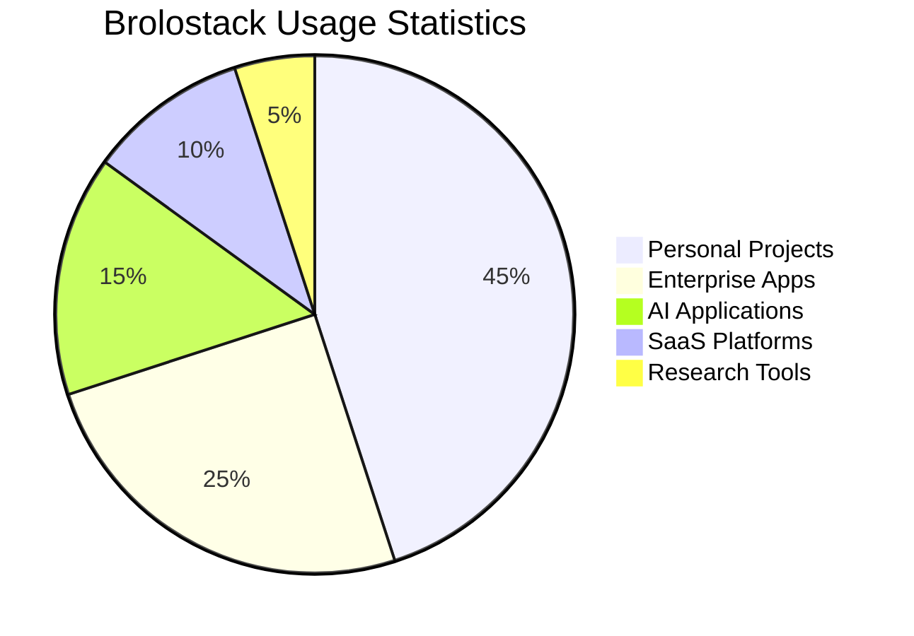

---

## 🏢 Author & Organization

### 👨‍💻 **Author**: Olu Akinnawo
- **Department**: Technology & Innovation
- **Role**: Neo Cloud R&D Lead
- **Company**: Beunec Technologies, Inc.

### 🏢 **Organization**: Beunec Technologies, Inc.
- **Overview**: Beunec is a future-of-work research and deployment company that creates intelligent environments for collaboration between people, agents, and systems, focusing on productivity, ethics, and unified digital identity.
- **Vision**: To be world leading future-of-work organization.
- **Mission**: Intelligent work, agentic collaboration, ethical innovation, digital identity.

### 🏆 **Team Recognition**

Brolostack was conceived and developed in the **THINKUNIQ Lab**, a cutting-edge remote-based R&D work environment under the Technology & Innovation Department at Beunec Technologies, Inc. This project represents our commitment to pushing the boundaries of what's possible in web development.

---

## 📞 Support

### 🆘 Getting Help

| Support Channel | Response Time | Best For |
|----------------|---------------|----------|
| **📖 Documentation** | Instant | Learning, reference |
| **🐛 GitHub Issues** | 24-48 hours | Bug reports, feature requests |
| **💬 GitHub Discussions** | 12-24 hours | Questions, community help |
| **📧 Email Support** | 24-72 hours | Enterprise support |
| **💼 Enterprise Support** | 4-8 hours | Priority support |

### 📚 Resources

- **[📖 Complete Documentation](docs/)** - Comprehensive guides and API reference
- **[🚀 Quick Start Guide](docs/QUICK_START.md)** - Get started in 5 minutes
- **[💡 Example Applications](examples/)** - Real-world implementation examples
- **[🎥 Video Tutorials](https://youtube.com/@beunec)** - Step-by-step video guides
- **[📰 Blog Posts](https://beunec.co/blog)** - Latest updates and insights

### 🌐 Community

Join/Follow/Subscribe our Community for the Latest Updates:

- **[💼 LinkedIn](https://www.linkedin.com/company/beunecofficial/)** - Professional updates and networking
- **[📺 YouTube](https://www.youtube.com/@beunec)** - Tutorials, demos, and tech insights
- **[📸 Instagram (Beunec)](https://www.instagram.com/beunec_)** - Behind-the-scenes and company culture
- **[☁️ Instagram (Beunec Cloud)](https://www.instagram.com/beuneccloud)** - Cloud technology updates
- **[📅 Instagram (Beunec Daily)](https://www.instagram.com/beunec.daily)** - Daily tech news and updates
- **[🧵 Threads](https://www.threads.com/@beunec_)** - Real-time discussions and updates
- **[🐦 Twitter](https://x.com/beunecofficial)** - Latest announcements and tech news
- **[💼 Crunchbase](https://www.crunchbase.com/organization/beunec)** - Company profile and funding info
- **[💻 GitHub](https://github.com/beunec)** - Open source projects and contributions
- **[🎵 TikTok](https://www.tiktok.com/@beunec_)** - Quick tech tips and fun content

---

## 📄 License

This project is licensed under the **MIT License** - see the [LICENSE](LICENSE) file for details.

### 📋 License Summary

| Permission | Description |
|------------|-------------|
| ✅ **Commercial Use** | Use in commercial projects |
| ✅ **Modification** | Modify and adapt the code |
| ✅ **Distribution** | Distribute copies |
| ✅ **Private Use** | Use in private projects |
| ❌ **Liability** | No warranty or liability |
| ❌ **Warranty** | No warranty provided |

---

<div align="center">

## 🌟 **Made with ❤️ by the Beunec Technologies Team**

**Brolostack** - *Local-first full-stack so development for the modern era*

[](https://github.com/Beunec/brolostack)
[](https://www.npmjs.com/package/brolostack)
[](https://www.linkedin.com/company/beunecofficial/)
[](https://www.youtube.com/@beunec)
[](https://x.com/beunecofficial)
[](https://www.instagram.com/beunec_)

**⭐ Star this repository if you find it helpful!**

</div>
