# Enterprise Full-Stack Application Example

This example demonstrates how to use Brolostack v1.0.2 with all the new enterprise features including backend framework integrations, real-time communication, authentication, and AI capabilities.

## Features Demonstrated

- ✅ **PostgreSQL & Supabase Integration**
- ✅ **Real-time WebSocket Communication**
- ✅ **Enterprise Authentication & RBAC**
- ✅ **Server-Side Rendering (SSR)**
- ✅ **FastAPI Backend Integration**
- ✅ **CrewAI Multi-Agent System**
- ✅ **LangChain RAG Implementation**
- ✅ **Express.js Real-time Features**
- ✅ **NestJS Microservices**

## Architecture Overview

```mermaid
graph TB
    subgraph "🌐 Frontend (Brolostack)"
        A[React Application]
        B[SSR Manager]
        C[Auth Manager]
        D[WebSocket Manager]
    end
    
    subgraph "🔗 Backend Adapters"
        E[FastAPI Adapter]
        F[Express Adapter]
        G[NestJS Adapter]
    end
    
    subgraph "🤖 AI Frameworks"
        H[CrewAI Adapter]
        I[LangChain Adapter]
        J[AutoGen Adapter]
        K[LangGraph Adapter]
    end
    
    subgraph "💾 Databases"
        L[PostgreSQL]
        M[Supabase]
        N[Redis]
    end
    
    A --> B
    A --> C
    A --> D
    
    B --> E
    C --> F
    D --> G
    
    E --> H
    F --> I
    G --> J
    G --> K
    
    H --> L
    I --> M
    J --> N
```



## Quick Start

```bash
# Install dependencies
npm install brolostack@1.0.2
npm install @supabase/supabase-js socket.io-client

# Run the example
npm run dev
```

## Implementation Examples

### 1. Full-Stack Application with FastAPI

```typescript
// app.ts
import { 
  Brolostack, 
  FastAPIAdapter, 
  PostgreSQLAdapter,
  AuthManager,
  SSRManager 
} from 'brolostack';

// Initialize Brolostack
const app = new Brolostack({
  appName: 'enterprise-app',
  version: '1.0.2',
  debug: true
});

// Configure FastAPI backend
const fastAPIAdapter = new FastAPIAdapter({
  baseURL: 'http://localhost:8000',
  authentication: {
    type: 'bearer'
  },
  endpoints: {
    health: '/health',
    auth: '/auth',
    sync: '/api/brolostack/sync',
    ai: '/api/ai'
  }
});

// Configure PostgreSQL
const pgAdapter = new PostgreSQLAdapter({
  host: 'localhost',
  port: 5432,
  database: 'enterprise_app',
  username: 'postgres',
  password: 'password',
  schema: 'brolostack'
});

// Configure Authentication
const authManager = new AuthManager({
  provider: 'custom',
  endpoints: {
    login: 'http://localhost:8000/auth/login',
    logout: 'http://localhost:8000/auth/logout',
    refresh: 'http://localhost:8000/auth/refresh'
  },
  tokenStorage: 'localStorage',
  autoRefresh: true
});

// Configure SSR
const ssrManager = new SSRManager(app, {
  mode: 'hybrid',
  cacheStrategy: 'memory',
  cacheMaxAge: 3600,
  hydration: {
    strategy: 'lazy'
  }
});

// Connect all adapters
await fastAPIAdapter.connect();
await pgAdapter.connect();

// Create stores
const userStore = app.createStore('users', {
  users: [],
  currentUser: null,
  loading: false,
  
  // Actions
  fetchUsers: async () => {
    set({ loading: true });
    try {
      const users = await fastAPIAdapter.get('/users');
      set({ users, loading: false });
    } catch (error) {
      set({ loading: false });
      throw error;
    }
  },
  
  createUser: async (userData: any) => {
    const user = await fastAPIAdapter.post('/users', userData);
    set(state => ({ users: [...state.users, user] }));
    return user;
  },
  
  login: async (credentials: any) => {
    const result = await authManager.login(credentials);
    set({ currentUser: result.user });
    return result;
  }
});

export { app, fastAPIAdapter, pgAdapter, authManager, ssrManager, userStore };
```

### 2. Multi-Agent AI Application with CrewAI

```typescript
// ai-app.ts
import { 
  Brolostack, 
  CrewAIAdapter, 
  LangChainAdapter,
  SupabaseAdapter 
} from 'brolostack';

// Initialize AI-focused Brolostack
const aiApp = new Brolostack({
  appName: 'ai-research-platform',
  version: '1.0.2'
});

// Configure CrewAI
const crewAI = new CrewAIAdapter({
  backendURL: 'http://localhost:8001',
  defaultLLM: {
    provider: 'openai',
    model: 'gpt-4',
    apiKey: process.env.OPENAI_API_KEY
  },
  memory: {
    enabled: true,
    provider: 'chromadb'
  }
});

// Configure LangChain for RAG
const langChain = new LangChainAdapter({
  backendURL: 'http://localhost:8002',
  vectorStore: {
    provider: 'chroma',
    config: {
      host: 'localhost',
      port: 8000
    }
  },
  embeddings: {
    provider: 'openai',
    model: 'text-embedding-ada-002',
    apiKey: process.env.OPENAI_API_KEY
  }
});

// Configure Supabase for data storage
const supabase = new SupabaseAdapter({
  url: process.env.SUPABASE_URL!,
  anonKey: process.env.SUPABASE_ANON_KEY!,
  realtime: true
});

// Connect adapters
await crewAI.connect();
await langChain.connect();
await supabase.connect();

// Create AI research crew
const researchCrew = await crewAI.createCrew({
  name: 'Research Team',
  agents: [
    {
      role: 'Senior Research Analyst',
      goal: 'Conduct thorough research on given topics',
      backstory: 'Expert researcher with 10+ years experience',
      tools: ['web_search', 'document_analysis', 'brolostack_data_reader'],
      verbose: true
    },
    {
      role: 'Data Scientist',
      goal: 'Analyze data and provide insights',
      backstory: 'Experienced data scientist specializing in AI/ML',
      tools: ['data_analysis', 'visualization', 'statistical_modeling'],
      verbose: true
    },
    {
      role: 'Technical Writer',
      goal: 'Create comprehensive reports and documentation',
      backstory: 'Technical writer with expertise in AI and research',
      tools: ['document_generator', 'report_formatter'],
      verbose: true
    }
  ],
  tasks: [
    {
      description: 'Research the given topic thoroughly using available tools',
      expectedOutput: 'Comprehensive research findings with sources',
      agent: 'Senior Research Analyst'
    },
    {
      description: 'Analyze the research data and extract key insights',
      expectedOutput: 'Data analysis report with visualizations',
      agent: 'Data Scientist'
    },
    {
      description: 'Create a professional report based on research and analysis',
      expectedOutput: 'Well-formatted research report',
      agent: 'Technical Writer'
    }
  ],
  process: 'sequential',
  verbose: true,
  memory: true
});

// Create research store
const researchStore = aiApp.createStore('research', {
  projects: [],
  activeProject: null,
  crews: [],
  executions: [],
  
  // Actions
  createProject: async (projectData: any) => {
    const project = await supabase.insert('research_projects', {
      ...projectData,
      created_at: new Date().toISOString()
    });
    
    set(state => ({ projects: [...state.projects, project] }));
    return project;
  },
  
  startResearch: async (projectId: string, topic: string) => {
    const execution = await crewAI.kickoffCrew(researchCrew.id, {
      topic,
      project_id: projectId
    });
    
    set(state => ({ executions: [...state.executions, execution] }));
    return execution;
  },
  
  queryKnowledge: async (question: string) => {
    const ragChain = await langChain.createRAGChain({
      name: 'research_rag',
      vectorStore: 'research_docs',
      retrievalConfig: {
        k: 5,
        searchType: 'similarity'
      }
    });
    
    return await langChain.queryRAG(ragChain, question);
  }
});

export { aiApp, crewAI, langChain, supabase, researchStore };
```

### 3. Real-time Collaboration with Express.js

```typescript
// collaboration-app.ts
import { 
  Brolostack, 
  ExpressAdapter, 
  WebSocketManager,
  AuthManager 
} from 'brolostack';

// Initialize collaboration app
const collabApp = new Brolostack({
  appName: 'real-time-collaboration',
  version: '1.0.2'
});

// Configure Express.js backend
const expressAdapter = new ExpressAdapter({
  baseURL: 'http://localhost:3000',
  authentication: {
    type: 'jwt',
    jwtSecret: process.env.JWT_SECRET
  },
  socketIO: {
    enabled: true,
    transports: ['websocket', 'polling']
  }
});

// Configure WebSocket for real-time features
const wsManager = new WebSocketManager({
  url: 'ws://localhost:3000/ws',
  reconnect: true,
  heartbeatInterval: 30000,
  authentication: {
    type: 'bearer',
    token: localStorage.getItem('jwt_token')
  }
});

// Connect adapters
await expressAdapter.connect();
await wsManager.connect();

// Create collaboration store
const collabStore = collabApp.createStore('collaboration', {
  documents: [],
  activeUsers: [],
  changes: [],
  
  // Real-time actions
  joinDocument: async (documentId: string) => {
    expressAdapter.joinRoom(`document_${documentId}`);
    wsManager.joinChannel(`doc_${documentId}`, 'current_user');
  },
  
  updateDocument: async (documentId: string, changes: any) => {
    // Save to backend
    await expressAdapter.put(`/documents/${documentId}`, changes);
    
    // Broadcast to other users
    wsManager.sendToChannel(`doc_${documentId}`, {
      type: 'document_update',
      payload: { documentId, changes, userId: 'current_user' }
    });
    
    // Update local state
    set(state => ({
      changes: [...state.changes, { documentId, changes, timestamp: new Date() }]
    }));
  },
  
  handleRealtimeUpdate: (update: any) => {
    set(state => ({
      changes: [...state.changes, update],
      documents: state.documents.map(doc => 
        doc.id === update.documentId 
          ? { ...doc, ...update.changes }
          : doc
      )
    }));
  }
});

// Set up real-time event handlers
wsManager.on('channel-message-received', (data) => {
  if (data.message.type === 'document_update') {
    collabStore.getState().handleRealtimeUpdate(data.message.payload);
  }
});

export { collabApp, expressAdapter, wsManager, collabStore };
```

### 4. Enterprise Application with NestJS

```typescript
// enterprise-app.ts
import { 
  Brolostack, 
  NestJSAdapter, 
  AuthManager,
  PostgreSQLAdapter 
} from 'brolostack';

// Initialize enterprise application
const enterpriseApp = new Brolostack({
  appName: 'enterprise-platform',
  version: '1.0.2'
});

// Configure NestJS backend
const nestAdapter = new NestJSAdapter({
  baseURL: 'http://localhost:4000',
  authentication: {
    type: 'jwt',
    strategies: ['jwt', 'local', 'google', 'microsoft']
  },
  swagger: {
    enabled: true,
    path: 'api/docs'
  },
  microservices: {
    enabled: true,
    transport: 'REDIS'
  },
  graphql: {
    enabled: true,
    subscriptions: true
  }
});

// Configure enterprise authentication
const enterpriseAuth = new AuthManager({
  provider: 'custom',
  endpoints: {
    login: 'http://localhost:4000/auth/login',
    logout: 'http://localhost:4000/auth/logout',
    refresh: 'http://localhost:4000/auth/refresh'
  },
  tokenStorage: 'secure',
  autoRefresh: true,
  multiFactorAuth: {
    enabled: true,
    methods: ['totp', 'email']
  }
});

// Configure PostgreSQL for enterprise data
const enterpriseDB = new PostgreSQLAdapter({
  host: 'localhost',
  port: 5432,
  database: 'enterprise_db',
  username: 'enterprise_user',
  password: process.env.DB_PASSWORD!,
  ssl: true,
  schema: 'enterprise',
  poolSize: 20
});

// Connect all adapters
await nestAdapter.connect();
await enterpriseAuth.login({ username: 'admin', password: 'secure_password' });
await enterpriseDB.connect();

// Create enterprise stores
const enterpriseStore = enterpriseApp.createStore('enterprise', {
  employees: [],
  departments: [],
  projects: [],
  analytics: {},
  
  // Employee management
  fetchEmployees: async () => {
    const employees = await nestAdapter.typeormQuery({
      entity: 'Employee',
      operation: 'find',
      relations: ['department', 'projects']
    });
    
    set({ employees });
    return employees;
  },
  
  createEmployee: async (employeeData: any) => {
    // Check permissions
    if (!enterpriseAuth.hasPermission('employees', 'create')) {
      throw new Error('Insufficient permissions');
    }
    
    const employee = await nestAdapter.typeormQuery({
      entity: 'Employee',
      operation: 'save',
      data: employeeData
    });
    
    set(state => ({ employees: [...state.employees, employee] }));
    
    // Send notification via microservice
    await nestAdapter.sendMicroserviceMessage('notification-service', 'employee-created', {
      employee,
      createdBy: enterpriseAuth.getCurrentUser()?.id
    });
    
    return employee;
  },
  
  // Analytics
  generateReport: async (reportType: string, parameters: any) => {
    // Use GraphQL for complex queries
    const query = `
      query GenerateReport($type: String!, $params: JSON!) {
        generateReport(type: $type, parameters: $params) {
          id
          data
          generatedAt
          downloadUrl
        }
      }
    `;
    
    const result = await nestAdapter.graphqlQuery(query, {
      type: reportType,
      params: parameters
    });
    
    return result.generateReport;
  }
});

export { enterpriseApp, nestAdapter, enterpriseAuth, enterpriseDB, enterpriseStore };
```

## Backend Implementation Examples

Each backend framework includes complete implementation examples in the `backend-examples/` directory:

- **`fastapi-example/`** - Complete FastAPI backend with Brolostack integration
- **`flask-example/`** - Flask microservice with real-time features
- **`express-example/`** - Express.js backend with Socket.IO
- **`nestjs-example/`** - Enterprise NestJS backend with all features
- **`ai-backends/`** - AI framework backend implementations

## Deployment

See individual backend examples for deployment configurations including:

- Docker Compose setups
- Kubernetes manifests
- Environment configurations
- Production optimizations

## Testing

```bash
# Run frontend tests
npm test

# Run backend integration tests
npm run test:integration

# Run end-to-end tests
npm run test:e2e
```

This example showcases the full power of Brolostack v1.0.2 for enterprise applications with seamless backend integration across multiple frameworks and AI capabilities.
